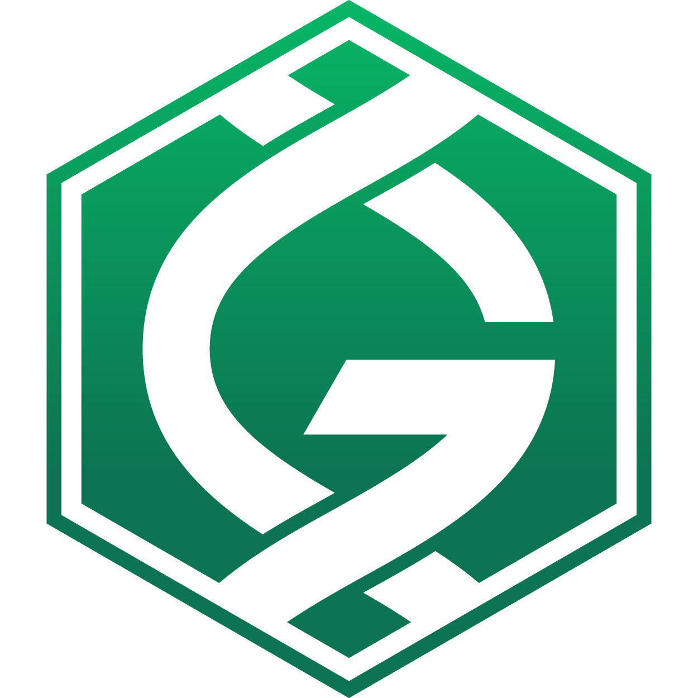

# Gridcoin Docker Image 

 



This is a docker image that runs a gridcoin wallet on your machine. I created it because I had a bit of difficulty compiling the gridcoin client on my computer and decided that I wasn't going to do this for all the computers I have - enter Docker and the ease of use with downloading an image that I don't really install.

I hope you find this image useful and if you have any recomendations, submit a pull request/issue or send me an email at vishakhpradeepkumar@gmail.com - I'd love to make this image better.


# How to run this image?

Run this in your terminal.


## Create a data volume called gridcoin_gary

```bash
docker volume create --name gridcoin_gary \
                     --opt device=:/path/to/dir \
```

## Create an instance of the gridcoin wallet via this command:

```bash
docker run -ti --rm -v gary:/root/.GridcoinResearch \
           -e DISPLAY=$DISPLAY_MAC \
           -v "/Library/Application Support/BOINC Data":/root/boinc_dir \
           -v /tmp/.X11-unix:/tmp/.X11-unix \
           --autorestart ON_FAILURE \
           -it grokkingstuff/gridcoin
```

Unfortunately, this works only for Macs as the GUI display requires the X-server (that's on Docker, not me) - much better instructions can be found here. I'll add instructions for Linux and Windows later. You're more than welcome to add a pull request :D


# FAQ

## Is this safe to use in a mature mining rig.

HAHAHAHAHAHAHAHAHA.
No.

Not yet anyway. It's rather early to use it properly. Untill it's seen some actual use, I can't give you a guarentee.
But I can say it hasn't crashed yet. I'm hoping it's a good sign (and not a catastrophe going to happen.)

In any case, you won't lose your data. I know docker images are ephemeral and that's why I have a data volume for that - it will remain even if you restart the image (or it crashes.) All you have to do is inspect the contents on the volume.

## I'd like to backup my wallet.

While the data volume is safe, I do appreciate the concern that a wallet might be corrupted or lost. 

## I try to download blocks and the thing stops working! Why?

After the wallet downloads the blocks, the wallet restarts itself which tells docker it's stopped.
I currently don't have a fix for that. My suggestion is to not use that option for now - at some point, I'll try to fix that.
<<<<<<< HEAD

You really shouldn't have to do that since the image comes with a snapshot of the blockchain - this image has batteries included.

## I got an error message that says that it can't load the graphical interface

I'd recommend looking at the way you've set up X-server. My recommendation is to use the instructions [here](https://github.com/chanezon/docker-tips/blob/master/x11/README.md). I use the proxying option myself - it's easy to do and works reliably.

=======

You really shouldn't have to do that since the image comes with a snapshot of the blockchain - this image has batteries included.

## I got an error message that says that it can't load the graphical interface

I'd recommend looking at the way you've set up X-server. My recommendation is to use the instructions [here](https://github.com/chanezon/docker-tips/blob/master/x11/README.md). I use the proxying option myself - it's easy to do and works reliably.

>>>>>>> dev
## Why on earth is the dockerhub repo under grokkingstuff while your name is grokkingStuff ? (note the capitalization of the s)

Docker Hub didn't allow me to use a capital S in my username. I'm so sorry for any confusion that causes.

# Other stuff
Feel free to critize this image as much as possible - or just add your own pull request.


# Stuff I might have to add.
Currently


Wallet location: /root/.GridcoinResearch/wallet.dat


How do i back up my wallet?

gridcoinresearchd backupwallet